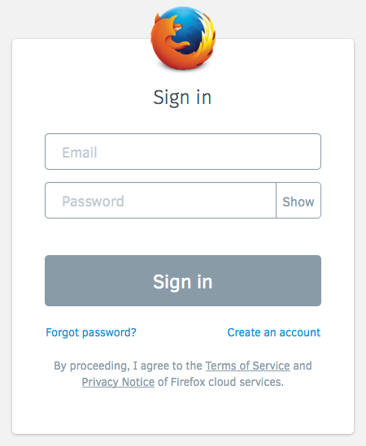
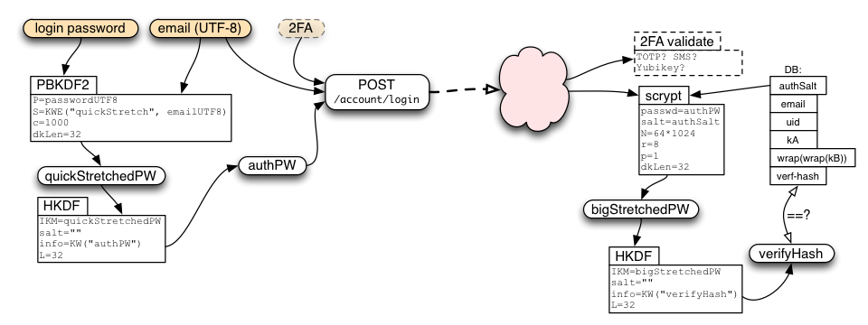
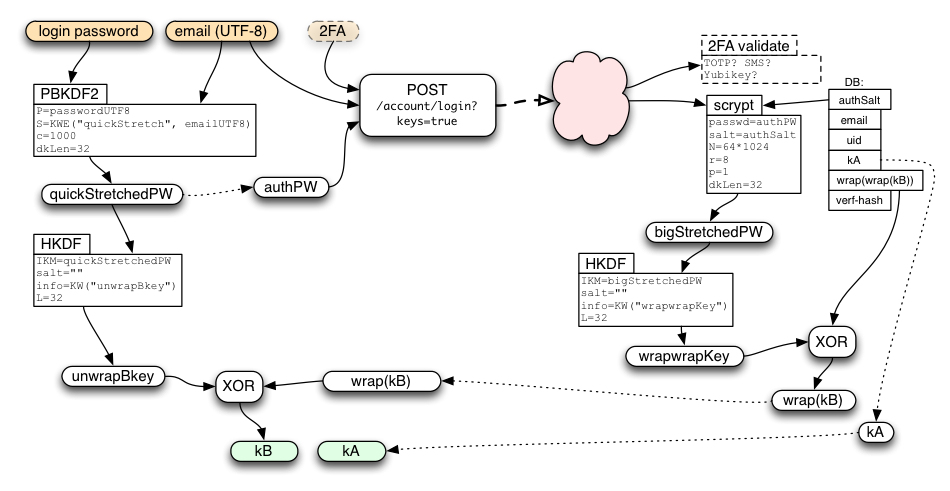

Slug: 50-new-sync-protocol
Date: 2014-03-25 18:05
Title: The new Sync protocol

(This wraps up a two-part series on recent changes in Firefox Sync, based on [my presentation](http://people.mozilla.org/~bwarner/warner-rwc2014/#/) at [RealWorldCrypto 2014](http://realworldcrypto.wordpress.com/). Part 1 was about problems we observed in the old Sync system. Part 2 is about the protocol which replaced it.)

[Last time](../../blog/49-pairing-problems) I described the user difficulties we observed with the pairing-based Sync we shipped in Firefox 4.0. In late April, we released Firefox 29, with a new password-based Sync setup process. In this post, I want to describe the protocol we use in the new system, and their security properties.

(For the cryptographic details, you can jump directly to the full [technical definition](https://github.com/mozilla/fxa-auth-server/wiki/onepw-protocol) of the protocol, which we've nicknamed "onepw", since there is now just "one password" to protect both account access and your encrypted data)

## Design Constraints

To recap the last post, the biggest frustration we saw with the old Sync setup process was that it didn't "work like other systems": users *thought* that their email and password would be sufficient to get their data back, but in fact it required access to a device that was already attached to your account. This made it unsuitable for people with a single device, and made it mostly impossible to recover from the all-too-common case of losing your only browser. It also confused people who thought email+password was the way to set up a new browser.

At about the same time, we were also building a new system called Firefox Accounts, aka "FxA", which will be used to manage access to Mozilla's new server-based features like the application marketplace and FirefoxOS-specific services.

So our design constraints for the new Sync setup process were:

* must work well with Firefox Accounts
* must sign in with traditional email and password: no pre-connected device necessary
* all Sync data must be end-to-end encrypted, just like before, using a key that is only available to you and your personal devices

## Enter Firefox Accounts: Login + Keys

To meet these constraints, we designed Firefox Accounts to both support the needs of basic login-only applications, *and* provide the secret keys necessary to safely encrypt your Sync data, while using traditional credentials (email+password) instead of pairing.

For login, FxA uses BrowserID-like certificates to affirm your control over a GUID-based account identifier. These are used to create a "[Backed Identity Assertion](https://github.com/mozilla/id-specs/blob/prod/browserid/index.md#backed-identity-assertion)", which can be presented (as a bearer token) to a server. The Sync servers require one of these assertions before granting read/write access to the encrypted data they store.

Each account also manages a few encryption keys, one of which is used to encrypt your Sync data.

## What Does It Look Like?

In Firefox 29, when you set up Sync for the first time, you'll see a box that asks for an email address and a (new) password:

You fill that out, hit the button, then the server sends you a confirmation email. Click on the link in the email, and your browser automatically creates an encryption key and starts uploading ciphertext.

Connecting a second device to your account is as simple as signing in with the same email and password:

## The Gory Details

This section describes how the new Firefox Accounts login protocol protects your password, the Sync encryption key, and your data. For full documentation, take a look at the [key-wrapping protocol specs](https://github.com/mozilla/fxa-auth-server/wiki/onepw-protocol) and the [server implementation](https://github.com/mozilla/fxa-auth-server).

### Encryption Keys

Each account has two full-strength 256-bit encryption keys, named "kA" and "kB". These are used to protect two distinct categories of data: recoverable "class-A", and password-protected "class-B". Nothing uses class-A yet, so I'll put that off until a future article.

Sync data falls into class B, and uses the "kB" key, which is protected by your account password. In technical terms, the FxA server holds a "wrapped copy" of kB, which requires your password to unwrap. Nobody knows your password but you and your browser, not even Mozilla's servers. Not even for a moment during login. The same is true for kB.

To access any data encrypted under kB, you must remember your password. This means that anyone who **doesn't** know the password can't see your data.
 
If you forget the password, you'll have to reset the account and create a new kB, which will erase both the old kB and the data it was protecting. This is a necessary consequence of properly protecting kB with the password: if there were any other way for **you** to recover the data without the password, then a bad guy could do the same thing.

"kB" is a "root" key: each application (like Sync) will get a distinct derivative key for their own class-B data. That way each application gets its own encryption key, so they won't be able to decrypt data that was meant for a different application. Sync is the only application we have so far, but we may add more in the future.

### Keeping your secrets safe

To make sure your Sync data is really end-to-end encrypted, we must avoid ever letting the server figure out your password, otherwise it could learn kB and decrypt your data.

The first line of defense is that the server is never told your raw password: you must prove that you know the password, but that's not the same thing as revealing it. The client sends a hashed form of the password instead.

The second line of defense is that the protocol uses "key-stretching" on the password before sending anything to the server, to make it hard for a compromised server to even attempt to guess your password. This stretching is pretty lightweight (1000 rounds of [PBKDF2-SHA256](https://tools.ietf.org/html/rfc2898#section-5.2)), but only needs to protect against the attacker who gets to see the stretched password in-flight (either because they compromised the server, or they've somehow broken TLS).

Finally, the data stored on the server is stretched even further, to make a static compromise of the server's database less useful to an attacker. This uses the "[scrypt](http://www.tarsnap.com/scrypt.html)" algorithm, with parameters of (N=64k, r=8, p=1). At these settings, scrypt takes 64MB of memory, and about 250ms of CPU time.

This complicated diagram shows how the password is processed before sending anything to the server:

And this one shows how the password is used to unwrap the server's response when it gets back to the client:

## Security Properties

Sync retains the same end-to-end security that it had before. The difference is that this security is now derived from your password, rather than pairing. So your security depends upon having a good password: if someone can guess it, they'll be able to connect their own browser to your account and then see all the Sync data you've stored there. 

On the flip side, by using passwords, you can connect a new browser to your account without having an existing device nearby to pair with, and you can even recover your Sync data after losing your last device, neither of which was possible with the old pairing process.

### How Hard Is It For Someone To Guess My Password?

The main factor is how well you generate the password. The best passwords are randomly generated by your own computer. The process you use (or rather the process that an attacker *thinks* you used) determines a set of possible passwords, which an attacker would need to try, one at a time, until they find the right one. Hopefully this set is very very large: billions or trillions at least.

The difficulty of testing each guess depends upon what the attacker has managed to steal. Regular attackers out on the internet are limited to "online guessing", which means they just try to sign in with your email address and their guessed password, one at a time, and see whether it works or not. This is rate-limited by the server, so they'll only get dozens or maybe hundreds of guesses before the server cuts them off.

An attacker who gets a copy of the server's database (perhaps through an SQL injection attack, the sort you read about every month or two) have to spend about a second of computer time for each guess, which [adds up](http://keywrapping.appspot.com/) when they must try a lot of them. The most serious kind of attack, where the bad guy gets full control of the server and can eavesdrop on login requests, yields an easier offline guessing attack (PBKDF rather than scrypt) which could be made cheaper with specialized hardware.

The security of old Sync didn't depend upon a password, because the pairing protocol it used meant there were no passwords.

### Can I Change My Password?

Of course! From the Preferences menu, choose the Sync tab, and hit the "Manage" link. That will take you to the "Manage account" page, which has a "Change password" link, where you can just type your old and new passwords. Changing your password will automatically disconnect any other browsers that were syncing with your account. You'll need to re-sign-in on those browsers before they'll be able to resume syncing. All of your server-side data will be retained.

### What Happens If I Forget My Password?

If you can't remember your password, you'll have to reset your account (by using the "Forgot password?" link from the login screen). This will send you a password-reset confirmation email with a link in it. Click on the link, and you'll be taken to a page where you can set up a new password. As with changing your password, this will disconnect all browsers from your account, so once you've finished the reset process, you'll need to sign back into each browser with your new password.

Resetting the account will necessarily erase any data stored on the server. To be precise, the old data is irretrievable (since it was encrypted by a key that was wrapped by your now-forgotten password; since you can't recover the key, you can't recover the data either), and the Sync storage server will erase the old data when it learns that you're using a new encryption key.

If you reset your account from a browser that was already syncing and up-to-date, then after you reconnect, your browser will simply repopulate the server with your bookmarks/etc, and nothing will be lost. It's also fine to reset your account from one (empty) browser, then reconnect a second (full) browser: your data will be merged, and everything will eventually be available on both devices.

The one case where you can't recover your old data is if you lose or break your only device and also forget your password. In this case, when you reset your account from a new (empty) browser, then your old Sync data is lost, and you'll have to start again from a blank slate. You may want to write down your password in a safe place at home to avoid this, sort of like leaving a spare housekey with a trusted neighbor in case you lose your own.

### What If I'm Already Running Sync?

If you've been using Sync for a while now, you probably set up Sync with the pairing scheme from Firefox 28 or earlier. Never fear! Your browsers will continue to sync with each other even after you upgrade some or all of them to FF29.

If you're still running FF24 ESR ([Extended Support Release](http://www.mozilla.org/en-US/firefox/organizations/faq/)) or another pre-FF29 browser, you can still use the pairing flow to connect additional old browsers. We'll support this flow until at least the end of the ESR maintenance period (14-Oct-2014), maybe a bit longer, but eventually we'll shut down the servers necessary to support the old pairing flow, and pairing will stop working. We hope to have a new pairing system in place by then: see below.

Likewise, after most users have migrated to New Sync, and everyone has been given fair notice to upgrade, the old-style Sync storage servers will eventually be shut down. But for now, existing Sync users don't need to make any changes.

However, pairing-based Old Sync and password-based FxA-powered New Sync don't mix: if you used pairing to connect two FF28 browsers together, you won't be able to connect a third FF29 browser to them, even if you upgrade them all to FF29. You'll need to move everything to FxA to connect all three:

* upgrade everything to FF29
* disconnect both old browsers from Sync
* create a Firefox Account
* sign all three browsers into your new account with the same email and password

This process won't lose any data: everything will be merged together in the new account.

## Future Directions

We're [working](https://id.etherpad.mozilla.org/fxa-2FA) on adding two-factor authentication ("2FA") to Firefox Accounts. If you enable this, you'll need to type in an additional code (generally provided by your mobile phone) when you log in. The two main options we're investigating are TOTP one-time passwords (e.g. the Google Authenticator app), and SMS codes.

We are also looking for ways to re-introduce pairing as an optional feature, after the main login. This might use an additional key "kC", which is only transferred via pairing. Once enabled, to set up Sync on a new device, you would need grant it permission from an old device that is already connected. We think we can make the pairing experience better than it was before, because we'll have more information to work with (you've already logged in, so we know which other devices might be available for pairing).

## Conclusion

The new Sync sign-up process is now live and adding thousands of users every day. The password-based process makes it possible to use Sync with just a single device: as long as you can remember the password, you can get back to your Sync data. It still encrypts your data end-to-end like before, but it's important to generate a good random password to protect your data completely.

To set up Sync, just upgrade to Firefox 29, and follow the "Get started with Sync" prompts on the welcome screen or the Tools menu.

Happy Syncing!

(thanks to Karl Thiessen, Ryan Kelly, and Chris Karlof for invaluable feedback)
