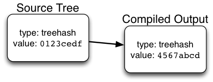
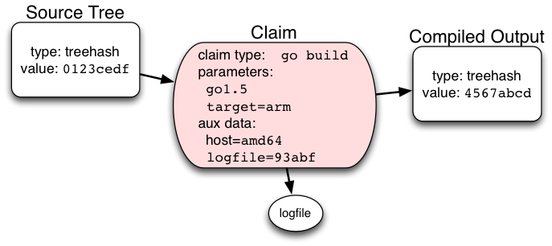
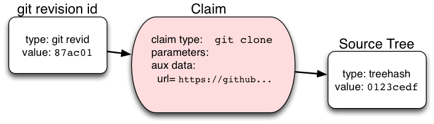
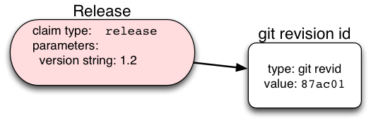
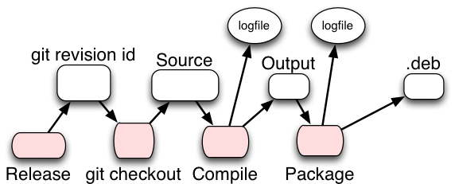
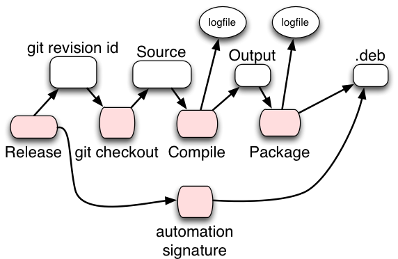

Slug: build-transparency
Date: 2016-01-22 14:54
Title: Build Transparency

!BEGIN-SUMMARY!
[Certificate Transparency](http://www.certificate-transparency.org/)
brings audits and early detection of mis-issuance to the TLS world. By
publish logs of reproducible (and non-reproducible) build steps, we can
achieve something similar for installable software packages.
!END-SUMMARY!

## The Problem: You Want Me To Run *What*?

As a whole, our industry is really bad at writing software securely.
It's understandable: the problem is huge. The editor I'm using for this
post has 250 thousand lines of C code, plus a million lines of LISP.
This runs on a windowing system that's probably just as big, and both
live on top of a kernel that could be even bigger. Experience shows that
probably 1% of those lines are faulty somehow, and any one of them could
be broken in a way that compromises security. That's tens of thousands
of bugs, just waiting for someone to find them, good or bad.

Simply installing the ["sloccount"](http://www.dwheeler.com/sloccount/)
tool (to count those lines) exposes me to a slew of vulnerabilities.
There might be something
[malicious](https://community.rapid7.com/community/infosec/blog/2015/12/20/cve-2015-7755-juniper-screenos-authentication-backdoor)
(or
[exploitable](https://www.imperialviolet.org/2014/02/22/applebug.html))
in the author's source code, misbehavior introduced by a
[malware-infected compiler](http://researchcenter.paloaltonetworks.com/2015/09/novel-malware-xcodeghost-modifies-xcode-infects-apple-ios-apps-and-hits-app-store/),
or
[something](http://arstechnica.com/information-technology/2015/05/sourceforge-grabs-gimp-for-windows-account-wraps-installer-in-bundle-pushing-adware/)
added to the compiled binary by whoever hosts the package I downloaded.

And since our applications run with full power over our local user
accounts (no isolation, sandboxing, or least-privilege), even a tiny bug
can result in complete system compromise.

We know about a few techniques that can help. I'm a big fan of
[object-capability security](http://erights.org/), but we don't yet have
the tooling or the languages to really take advantage of it on normal
operating systems. Sandboxing (the coarser big-sibling to objcap) is
showing good results in places like Qubes, Chromium, iOS, and some forms
of OS-X.

But the main tool we use is reactive: bug reports from users, which feed
back into fixes that go into new releases. Bad guys use the the most
exciting bugs to attack systems: we keep our ears open for reports of
these attacks, then we race to fix and distribute and install patches
before the attackers get around to targeting our system. All modern
operating systems (and many individual applications) include an
auto-update mechanism, to reduce the window of time between revealing a
flaw and deploying the fix.

## Why should I run that?

These auto-update mechanisms (at least the respectable ones) either sign
the updates or deliver them over TLS. It would be unfortunate if an
attacker could
[pretend to be the auto-update server](https://vulnsec.com/2016/osx-apps-vulnerabilities/)
and install a pre-compromised version. The details vary, but in the end
you're giving control over your computer to somebody who holds a
particular private key. More like one of a few hundred private keys,
since there's so much software on your computer.

And those applications were built on computers which are just as porous
and vulnerable as your own, and they include dozens of libraries, from
yet more computers. The enormous attack surface is, quite frankly,
intimidating. Some days I wonder how it is that computers work at all.
(I suspect the reason is that writing successful attacks is just as
frustrating as writing functional software, and less rewarding for most
of the people who can do it).

But, as a baseline, let's assume that you'll only run software that I've
signed. 

## What exactly am I running, anyways?

So If we can't make much headway on making software *better*, let's
focus on at least making it more *repeatable*. That way, maybe I can at
least be confident that I've got the *same bugs* as you do.

This can isolate the source of problems down to the source code, or some
specific part of the toolchain. And it can also block sneaky targetted
attacks. Say I've got some clever malware that I want to plant on your
machine, but I don't want to get caught. I could infiltrate the author's
computer and modify the code before they compile and sign it, but then
everybody will see the same attack code, and you might hear about it in
the papers before you ever run that update. So I want to deliver this
code to you and you alone, which means arranging for you to see a
different update than everyone else.

## That Looks Dangerous: You Go First

By only running code that other people have run first, you a

## Sources, Artifacts, and Links

Start with a directed graph of source trees and build artifacts:

Both nodes are a **treehash**: a git-style SHA256 hash value that covers
every filename and content byte of a directory tree. The edge is a
**claim** that a particular (well-known) compile process will transform
this source tree into a specific object directory.

Many claims are **reproducible**. For example, Go is supposed to produce
deterministic builds, even when cross-compiling. So if you vendor all
your sources, the compiled output should depend solely upon the version
of Go you're using, the target architecture, and the contents of the
source tree. The Claim node includes **parameters** for anything that is
expected to influence the output, and **auxiliary data** for anything
that isn't (but which might be important for debugging nondeterminism
later).

Claims can also reference logfiles, which might be stored separately and
only accessed when needed (e.g. to investigate inconsistent results).

Another sort of "compile" step is a source checkout: an actual git
revision hash should reliably identify a specific set of source files
too (until we start to see SHA1 collisions in the wild). So a
highly-reproducible Claim is that a given git revision should produce a
given source tree.

The git revision is sufficient to nail down the exact sources, so the
`git clone` claim does not need additional parameters, but the aux data
should contain a URL for the source repository as a hint to auditors as
to how to fetch the same data.

There is a many-to-one mapping from git revision ID to source tree hash,
and a one-to-many mapping from source tree to compiled output (for
different target architectures, toolchain versions, etc).

Tarball hashes are also source-like nodes.

Another sort of edge is a **release**: a claim that some project has
announced a mapping from a version string to a specific source tree. The
will frequently reference a git hash, although it might also point
directly to a specific tarball.

Finally, the last node in this chain would be a packaging artifact, like
a `.deb` or `.dmg` file. Each distribution has a well-known
transformation from "tree full of compiled output files" to a
single-file package. A "packaging claim" would link the output of the
build step to the final package file (identified by hash).

## Claims Are Signed

Each "edge" in this graph is actually a signed statement that some party
believes the source can be converted into the output using the specified
build process.

When the process is known to be deterministic, this claim can be
verified by others as part of the auditing process. When it is known to
be nondeterministic, verification will require more human intervention
(rebuild the same source using mostly the same tools, then investigate
and justify any differences in the output).

Claims reference their source and output nodes by hash.

Release claims may also reference earlier releases, with an edge that
basically means "if you were happy with that one, you should also be
happy with this one", or "this is a suitable replacement for that".

## Publishing the Build Audit Logs

Imagine a Debian-like build process that starts with a signed release
claim, performs a source checkout, compiles the result (on multiple
architectures), then packages the result.

The build automation adds another claim, which states that the given
.deb was produced (according to a well-known process) from the original
release tag. An end user who is willing to trust this automation only
needs to check this signature, rather than independently re-running all
the intermediate steps to generate (hopefully) an identical package.

This entire data structure is dumped into an append-only hash-based log,
like in CT. The package can be distributed along with proof (in the form
of a Merkle chain) that the .deb package (and the process which
constructed it) is present in the public log structure. The end user
(who receives the .deb file) can refuse to install anything which is not
traceable to this public log.

Not all nodes of the data structure must necessarily be made public, but
their contents must be hashed into the public log. If and when an audit
is necessary, the vendor can reveal the log that matches the published
hashes.

### That Looks Dangerous: You Go First

For users who live on the bleeding edge and want to install
recently-packaged software without waiting for the CT log to be updated,
they can at least submit the claimed proof (along with the full contents
of the .deb) to the log before installing. That way, if something does
go wrong, at least there is forensic evidence available for surviving
users to examine later.

## Comparing Audits Upon Failure

This data structure exists to support an investigation if one of the
build products is found to behave unexpectedly. The goal is to identify
exactly where the misbehavior was injected, and hold either the tool or
the person wielding it responsible. If an installed package is found to
be malicious:

* Compare the .deb hash against the public log. If it differs, the user
  was given a non-standard package, possibly as a narrowly-targeted
  attack. Bleeding-edge users who upload their package to a public
  server before installing it will have binaries that can be decompiled
  and studied.

* Retrieve the build log from the vendor and reproduce the results.

  * If the compiled output matches but the packaging does not, then
    either the package was maliciously modified, or the packaging tool
    is not deterministic.
  * If the source matches but the compiled output does not, either the
    binary was modified or the compiler is misbehaving (this is where a
    [Thompson-esque "Trusting Trust"](http://dl.acm.org/citation.cfm?id=358210)
    attack might show up).
  * If the git revision matches but the source treehash does not,
    something has modified the source after git checkout

By tracing the unwanted changes back to the signed Release claim, the
toolchain may be exonerated and responsibility put squarely on the
original author (who either intentionally signed something malicious, or
was unable to keep their signing key safe).

## Storing / Publishing Everything

Locally, this data can be stored in a specialized graph database (Neo4j,
HyperGraphDB, OpenCog, etc). The most common query will be to find a
path (through Claims) from a Release signature to a given package node.
It could also be stored in a regular database with some extra tables to
track likely links.

IPFS may be an ideal way to publish this data: the core claims could be
written into a serialized data structure in a single node, then the
logfiles and intermediate build products stored in separate IPFS nodes
and only fetched on demand. The automated build machine would be
responsible for hosting the build artifacts until other interested
parties had a chance to retrieve copies for safekeeping.

Proprietary software vendors could arrange for an off-site auditor to
store copies of everything in escrow, to be opened for public scrutiny
only upon demand.
