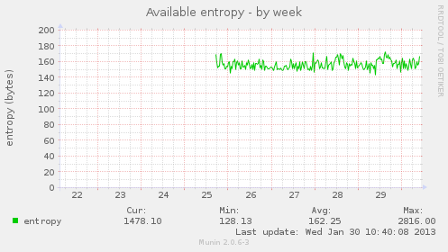
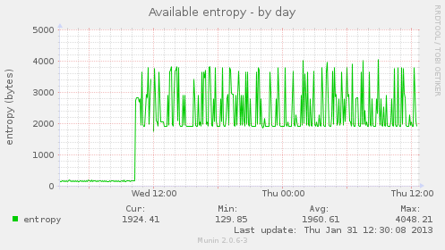

Slug: 48-remote-entropy
Date: 2014-03-04 10:29
Title: Remote Entropy
Category: security

**Can you safely deliver entropy to a remote system?**

Running a system without enough entropy is like tolerating a toothache:
something you'd really like to fix, but not quite bothersome enough to deal
with.
!END-SUMMARY!

I recently bought a [Simtec EntropyKey](http://www.entropykey.co.uk/) to fix
this locally: it's a little USB dongle with avalanche-noise generation
hardware and some firmware to test/whiten/deliver the resulting stream to the
host. The dongle-to-host protocol is encrypted to protect against even USB
man-in-the-middle attacks, which is pretty hardcore. I like it a lot. There's
a simple [Debian package](http://packages.debian.org/squeeze/ekeyd) that
continuously fills /dev/random with the results, giving you something more
like this (which would look even better if Munin didn't use entropy-consuming
TCP connections just before each measurement):

But that's on local hardware. What about virtual servers? I've got several
remote VPS boxes, little Xen/KVM/VirtualBox slices running inside real
computers, rented by the hour or the month. Like many "little" computers
(including routers, printers, embedded systems), these systems are usually
starved for entropy. They lack the sources that "big" computers usually have:
spinning disk drives and keyboards/mice, both of which provide mechanical- or
human- variable event timing. The EntropyKey is designed to bring good
entropy to "little" machines. But I can't plug a USB device into my remote
virtual servers. So it's pretty common to want to deliver the entropy from my
(real) home computer to the (virtual) remote boxes. Can this be done safely?

## Nope!

Well, mostly nope: it depends upon how you define the threat model. First,
let's go over some background.

## Guessing Internal State

Remember that entropy is how you measure uncertainty, and it's always
relative to an observer who knows some things but not others. If I roll an
8-sided die on my desk right now, the entropy from your point of view is 3
bits. From my point of view it's 0 bits: *I* know I just rolled a five. And
now that *you* know that I rolled a five, it's 0 bits from your POV too.

Computers use entropy to pick random numbers for cryptographic purposes:
generating long-term SSH/GPG/TLS keys, creating ephemeral keys for
Diffie-Hellman negotiation, unique nonces for DSA signatures, IVs, and TCP
sequence numbers. Most of these uses are externally visible: the machine is
constantly shedding clues as to its internal state. If the number of possible
states is limited, and an eavesdropper can observe all (or most) of these
clues, then they can deduce what that internal state is, and then predict
what it will be next. The amount of computation Eve needs to do this depends
upon how uncertain she is, and on the nature of the clues.

The most conservative model assumes that Eve sees every packet going into and
out of the system, with perfect timing data, and that she knows the complete
state of the system before the game begins (imagine that Eve creates a VM
from the same EC2 AMI as you do). If she is truly omniscient, and the system
is deterministic, then she will know the internal state of the system
forever: all she has to do is feed her own clone the same input as your box
receives, at the same time, and watch how its internal state evolves. She doesn't even need to watch what your box outputs: it will always emit the same things as her clone.

If she misses a few bits (maybe she can't measure the arrival time of a
packet perfectly), or if there are hidden (nondeterministic) influences, then
she needs to guess. For each guess, she needs to compare her subsequent
observations against the predicted consequences of that guess, to determine
which guess was correct. It's as if she creates a new set of nearly-identical
VMs for each bit of uncertainty, and then throws out most of them as new
measurements rule them out.

There might be a lot of potential states, and it might take her a lot of CPU
time to test each one. She might also not get a lot of observations, giving
her fewer opportunities to discard the unknowns. Our goal is to make sure she
can't keep up: at any important moment (like when we create a GPG key), the
number of possibilities must be so large that all keys are equally likely.

(In fact, our goal is to make sure she can't retroactively catch up either.
If we create a key, and then immediately reveal all the internal state,
without going through some one-way function first, she can figure out what
the state was *earlier*, and then figure out the key too. So the system also
needs forward-security.)

## Bootstrapping Towards Entropy Is Technically Impossible ...

To get out of this compromised Eve-knows-everything state, you have to feed
it with enough entropy (which are bits that Eve doesn't see) to exceed her
ability to create and test guesses. But she's watching the network. So you
must feed entropy in locally (via the keyboard, locally-attached hardware, or
non-deterministic execution).

Could you deliver entropy remotely if you encrypted it first? Sure, but you
have to make sure Eve doesn't know the key, otherwise she can see the data
too, and then it isn't entropy anymore. Encrypting it symmetrically (e.g.
AES) means your remote random-number generator machine shares a secret key
with the VM, but we already assumed that Eve knows the VM's entire state, so
it has no pre-existing secrets from her. To encrypt it asymmetrically (via a
GPG public key) means the VM has a corresponding private key: again, Eve's
insider knowledge lets her decrypt it too.

Can you use authenticated Diffie-Hellman to build a secure connection *from*
the VM to the remote entropy source? This would put a public key on the VM,
not a private one, so Eve doesn't learn anything from the key. But DH
requires the creation of a random ephemeral key (the "x" in "g^x"), and Eve
can still predict what the VM will do, so she can guess the ephemeral key
(using the published g^x to test her guesses), determine the shared DH key,
and decrypt the data.

So, in the most conservative model, there's no way to get out of this
compromised state using externally-supplied data. You *must* hide something
from Eve, by delivering it over a channel that she can't see.

## But It Might Be Possible In Practice

The real world isn't quite this bad, for a few reasons:

* watching every input is actually pretty hard. The packet sniffer must be
  running 24x7, never drop a packet, and must capture high-resolution
  timestamps very close to the VM's inputs

* busy computers have an awful lot of state, making Eve's worst-case modeling
  job pretty expensive. It's still deterministic, but depends on a lot of
  race conditions. The ideal kernel RNG would hash all of memory all the
  time, to make it maximally sensitive to system state. Unfortunately, that's
  expensive and intrusive ("hey! the kernel is reading my private user data
  and publishing some derivative of it to the world!"), and good engineering
  practice (modularity) prefers small sub-systems with *reduced* sensitivity
  to unrelated inputs, so we may not get as much benefit from this as we'd
  like.

* kernel RNGs are designed to be forward-secure: it's not as if /dev/urandom
  just returns the raw entropy pool. Every read and write causes the pool to
  be stirred. So observations don't reveal state directly, and Eve has to do
  (significant) computation to check her guesses.

* RNGs also batch inputs into larger chunks to prevent small incremental
  attacks. If we added one bit of entropy at a time (say, one per second),
  then let Eve make some observations, she could probably deduce that one bit
  in time to repeat the process for the next bit. But if we hide it in memory
  (i.e. not allow it to influence anything remotely observable) for a few
  minutes, and then dump 128 bits in all at once, Eve has 128 seconds to test
  2^128 possibilities, and won't be able to keep up.

## How To Do It

So in practice, once the kernel pool gets perhaps 128 or 256 bits of real
entropy, Eve's job becomes impossible. This needs to happen before any
significant secrets are generated. How can we get to this point?

* the best tool is a local hardware RNG that can feed entropy to the kernel
  without traversing the network. This might be a special CPU instruction
  (e.g. Intel's RdRand) that can be used by the guest VM. Or the guest VM
  should be able to ask the host OS (dom0) for entropy, which can get it from
  an on-chip HWRNG (VIA Padlock) or USB-attached EntropyKey. This source
  should be used very early during startup, before first-boot SSH host keys
  are generated. It can be periodically refreshed afterwards, but it's the
  initial seed that really matters.

* next best is for the guest VM creation process to include a unique initial
  seed. Linux systems typically save a few kB of entropy to disk at shutdown,
  and write it back into the kernel at boot: if the contents of disk remain
  secret, rebooting a box doesn't cause it to lose entropy. The control
  system that creates VMs could pre-populate this entropy file from a real
  RNG, with fresh data for each one. I don't know if EC2 AMIs work this way:
  I suspect the disk image is identical each time an AMI is instantiated, but
  the startup process might do something better.

* failing that, the VM should make network requests for entropy. These
  requests should go to a box that already has good entropy (perhaps relayed
  from box to box, ultimately supplied by some kind of HWRNG). And the
  requests should be as local as possible, so Eve would have to get her
  packet sniffer into the datacenter network to see it. Pulling entropy from
  multiple directions might help (maybe she can watch one router but not all
  of them). Pulling large amounts of data might help (maybe she won't be able
  to keep up with the data), as might pulling it frequently over a long
  period of time (maybe the sniffer breaks down every once in a while: if you
  can get 256 bits through while it's offline, you win). Try to include
  high-resolution timing data too (sample the TSC when you receive each
  packet and write the contents into the kernel pool along with the data).

You'd probably think you ought to encrypt these network requests, but as
described above it's not really clear what this buys you. The best hope is
that it increases the cost of Eve's guess-testing. You might not bother with
authenticating this link: if the RNG is well-designed, then it can't hurt to
add more data, even attacker-controlled data (but note that entropy counters
could be incorrectly incremented, which means it can hurt to *rely* on
attacker-controlled data).

Continuing this analysis, you might not even bother decrypting the data
before adding it to the pool, since that doesn't increase the entropy by more
than the size of the decryption key, so you can get the same effect by just
writing the key into the pool too. (But it might be more expensive for Eve if
her guess-testing function must include the decryption work).

And if you don't bother decrypting it, then clearly there's no point to
encrypting it in the first place (since encrypted random data is
indistinguishable from unencrypted random data). Which suggests that really
you're just piping /dev/urandom from one box into netcat, plus maybe some
timestamps, and just have to hope that Eve misses a packet or two.

### Entropy Counters

What about entropy counters, and the difference between /dev/random and
/dev/urandom? They're trying to provide two different things. The first is to
protect you against using the RNG before it's really ready, which makes a lot
of sense (see [Mining Your Ps and Qs](https://factorable.net/) for evidence
of failures here). The second is to protect you against attackers who have
infinite computational resources, by attempting to distinguish between
computational "randomness" and information-theoretic randomness. This latter
distinction is kind of silly, in my mind. Like other folks, I think there
should be one kernel source of entropy, it should start in the "off" mode
(return errors) until someone tells it that it is ready, and switch to the
"on" mode forevermore (never return errors or block).

But I'll have to cover that in another post. The upshot is that it isn't safe
to make this startup-time off-to-on mode switch unless you have some
confidence that the data you've added to the kernel's entropy pool is
actually entropy, so attacker-supplied data shouldn't count. But after you've
reached the initial threshold, when (in my opinion) you don't bother counting
entropy any more, then it doesn't hurt to throw anything and everything into
the pool.

([cross-posted](http://blog.mozilla.org/warner/2014/03/04/remote-entropy/) to my [work blog](http://blog.mozilla.org/warner))
