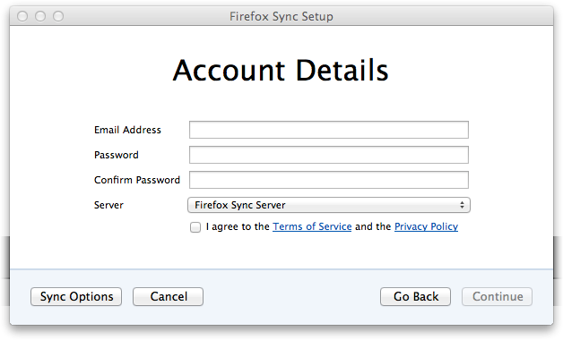
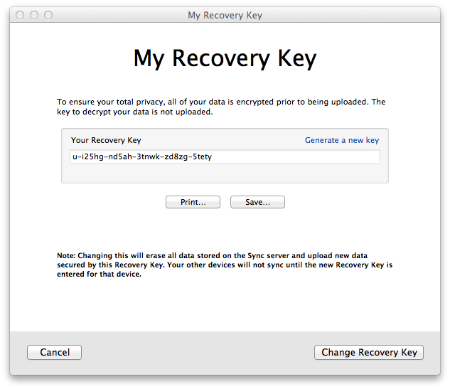

Slug: 49-pairing-problems
Date: 2014-04-02 10:09
Title: Pairing Problems

(This begins a two-part series on upcoming changes in Firefox Sync, based on [my presentation](http://people.mozilla.org/~bwarner/warner-rwc2014/#/) at [RealWorldCrypto 2014](http://realworldcrypto.wordpress.com/). Part 1 is about problems we observed in the old system. Part 2 will be about the system which replaces it.)

In March of 2011, [Sync](https://www.mozilla.org/en-US/firefox/sync/) made its debut in Firefox 4.0 (after spending a couple of years as the [Weave](https://blog.mozilla.org/labs/2007/12/introducing-weave/) add-on). Sync is the feature that lets you keep bookmarks, preferences, saved passwords, and other browser data synchronized between all your browsers and devices (home desktop, mobile phone, work computer, etc).

Our goal for Sync was to make it secure and easy to share your browser state among two or more devices. We wanted your data to be encrypted, so that only your own devices could read it. We weren't satisfied with just encrypting during transmission to our servers (aka "data-in-flight"), or just encrypting it while it was sitting on the server's hard drives (aka "data-at-rest"). We wanted proper end-to-end encryption, so that even if somebody broke into the servers, or broke SSL, your data would remain secure.

Proper end-to-end encryption typically requires manual key management: you would be responsible for copying a large randomly-generated encryption key (like `cs4am-qaudy-u5rps-x/qca-hu63l-8gjkl-28tky-6whlt-fn0`) from your first device to the others. You could make this easier by using a password instead, but that ease-of-use comes at a cost: short, easy-to-remember passwords aren't very secure. If an attacker could guess your password, they could get your data.

We didn't like that tradeoff, so we designed an end-to-end encryption system that didn't use passwords. It worked by "pairing", which means that every time you add a new device, you have to introduce it to one of your existing devices. For example, you could pair your home computer with your phone, and now both devices could see your Sync data. Then later, you'd pair your phone with your work computer, and now all three devices could synchronize together.

The introduction process worked by copying a short single-use "pairing code" from one device to the other. This code was fed into some crypto magic (the J-PAKE protocol), allowing the two devices to establish a temporary encrypted connection. Then everything necessary to access your account (including the random long-term data-encryption key) was copied through that secure connection to the new device.

The cool thing about pairing is that your data is safely protected by a strong encryption key, against everyone (even the Mozilla server that hosts it), and you don't need to manage the key. You never even see it.

## Problems With Pairing

But, !BEGIN-SUMMARY! we learned that our pairing implementation in Firefox Sync had some problems. Some were shallow, others were deep, but the net result is that a *lot* of people were confused by Sync, and we didn't get as many people using it as we'd hoped. This post is meant to capture some of the problems that we observed.

!END-SUMMARY!

## Idealized Design vs Actual Implementation

Back in those early days, four years ago now, I was picturing a sort of idealized Sync setup process. In this fantasy world, next to the rainbows and unicorns, the first machine would barely have a setup UI at all, maybe just a single button that said "Enable Sync". When you turned it on, that device would create an encryption key, and start uploading ciphertext. Then, in the second device, the "Connect To Sync" button would initiate the pairing process. At no point would you need a password or even an account name.

But, for a variety of reasons, by the time we had a working deliverable, our setup page looked like this:

Some of the reasons were laudable: having an email address lets us notify users about problems with their account, and establishing a password enabled things like a "Delete My Account" feature to work. But part of the reason included historical leftovers and backward-compatibility with existing prototypes.

In this system, the email address identified the account, and the password was used in an HTTP Basic Auth header to enable read/write access to encrypted data on the server. The data itself was encrypted with a random key, which came to be known as the "recovery key". The pairing process copied all three things to the new device.

## Deceptive UI

The problem here was that users still had to pick a password. The account-creation screen gave the impression that this password was important, and did nothing to disabuse them of the notion that email+password would be sufficient to access their data later. But the data was encrypted with the (hidden) key, not the password. In fact, this password was never entered again: it was copied to the other devices by pairing, not by typing.

It didn't help that Firefox Sync came out at about the same time as a number of other products with "Sync" in the name, all of which *did* use email+password as the complete credentials.

This wasn't so bad when the user went to set up a second device: they'd encounter the unusual pairing screen, but could follow the instructions and still get the job done. It was most surprising and frustrating for folks who used Firefox Sync with only one device.

## "Sync", not "Backup"

We, too, were surprised that people were using Sync with only one device. After all, it's obviously not a backup system: given how pairing works, it clearly provides no value unless you've got a second device to hold the encryption key when your first device breaks.

At least, it was obvious to me, living in that idealistic world with the rainbows and unicorns. But in the real world, you'd have to read the docs to discover the wonderous joys of "pairing", and who in the real world ever reads docs?

It turns out that an awful lot of people just went ahead and set up Sync despite having only one device. For a while, the *majority* of Sync accounts had only one device connected.

And when one of these unlucky folks lost that device or deleted their profile, then wanted to recover their data on a new device, they'd get to the setup box:

and they'd say, "sure, I Have an Account", and they'd be taken to the pairing-code box:

and then they'd get confused. Remember, for these users, this was the first time they'd ever heard of this "pairing" concept: they were expecting to find a place to type email+password, and instead got this weird code thing. They'd have no idea what those funny letters were, or what they were supposed to do with them. But they were desperate, so they'd keep looking, and would eventually find a way out: the subtle "I don't have the device with me" link in the bottom left.

Now, this link was intended to be a fallback for the desktop-to-desktop pairing case, where you're trying to sync two immobile desktop-bound computers together (making it hard to transcribe the pairing code), and involves an extra step: you have to extract the recovery key from the first machine and carry it to the second one. By "I don't have the device with me", we meant "another device exists, but it isn't here right now". It was never meant to be used very often.

This also provided a safety net: if you had magically known about the recovery key ahead of time, and wrote it down, you could recover your data without an existing device. But since pairing was supposed to be the dominant transfer mechanism, this wasn't emphasized in the UI, and there were no instructions about this at account setup time.

So when you've just lost your phone, or your hard drive got reformatted, it's not unreasonable to interpret "I don't have the device with me" as something more like "that device is no longer with us", as in, ["It's dead, Jim"](http://www.youtube.com/watch?v=MH7KYmGnj40).

Following the link gets them to the fallback dialog:

Which looked *almost* like what they were expecting: there's a place for an account name (email), and for the password that they've diligently remembered. But now there's this "Sync Key" field that they've never heard of. The instructions tell them to do something impossible (since "your other device" is broken). A lot of very frustrated people wound up here, and it didn't provide for their needs in the slightest.

Finally, these poor desperate users would click on the only remaining ray of hope, the "I have lost my other device" link at the bottom. Adding insult to injury, this actually provides instructions to reset the account, regenerate the recovery key, and *delete* all the server-side data. If you understand pairing, it's clear why deleting the data is the only remaining option (erase the ciphertext that you can no longer decrypt, and reload from a surviving device). But for most people who got to this point, seeing these instructions only caused even more confusion and anger:

(When reached through the "I have lost my other device" link, this dialog would highlight the "Change Recovery Key" button. This same dialog was reachable through Preferences/Sync, and is how you'd find your Recovery Key and record it for later use.)

## User Confusion

The net result was that a lot of folks just couldn't use Sync. You can hear the frustration in these quotes from SUMO, the Firefox support site, circa December 2013:

The upshot is that, while we built a multi-device synchronization system with excellent security properties and (ostensibly) no passwords to manage, a lot of people actually wanted a backup system, with an easy way to recover their data even if they'd only had a single device. And they wanted it to look just like the other systems they were familiar with, using email and password for access.

## Lessons Learned

We're moving away from pairing for a while: Firefox 29 will transition to Firefox Accounts (abbreviated "FxA"), in which each account is managed by an email address and a password. Sync will still provide end-to-end encryption, but accessed by a password instead of pairing. My next post will describe the new system in more detail.

But we want to bring back pairing some day. How can we do it better next time? Here are some lessons I've learned from the FF 4.0 Sync experience:

* do lots of user testing, early in the design phase
* *especially* if you're trying to teach people something new
* pay attention to all the error paths
* if your application behaves differently than the mainstream, make it look different too
* observe how people use your product, figure out what would meet their expectations, and try to build it
* if you think their expectations are "wrong" (i.e. they don't match *your* intentions), that's ok, but now you have two jobs: implementation *and* education. Factor that into your development budget.

I still believe in building something new when it's better than the status quo, even if it means you must educate your users. But I guess I appreciate the challenges more now than I did four years ago.

([cross-posted](http://blog.mozilla.org/warner/2014/04/02/pairing-problems/) to my [work blog](http://blog.mozilla.org/warner))
